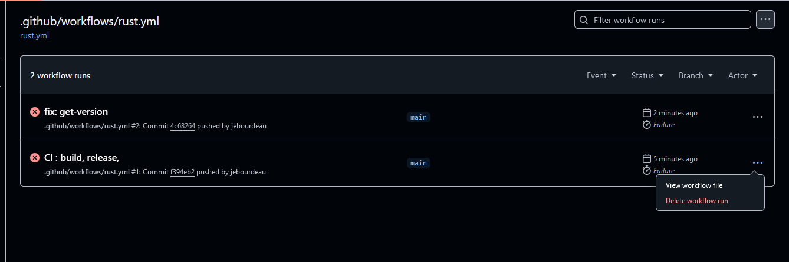
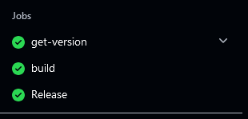
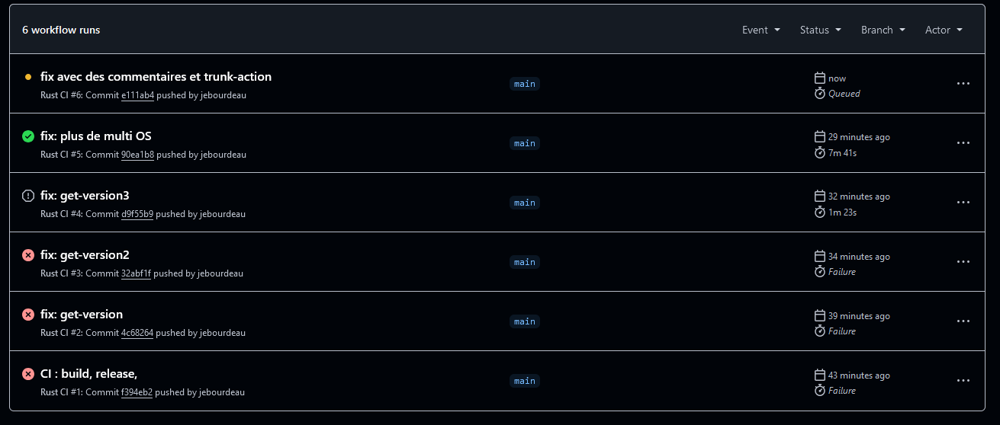

les différentes étapes que j'ai réalisé :

* Extraction du fichier zipper .gz
* transfert sur github sous le nom Brief11
* creation d'un dossier .github/workflows/rust.yml

  version non Fix au début.

 version opérationnel mais pas de release

 version avec release.

creation d'une branche beta

ajout de la release à la fin